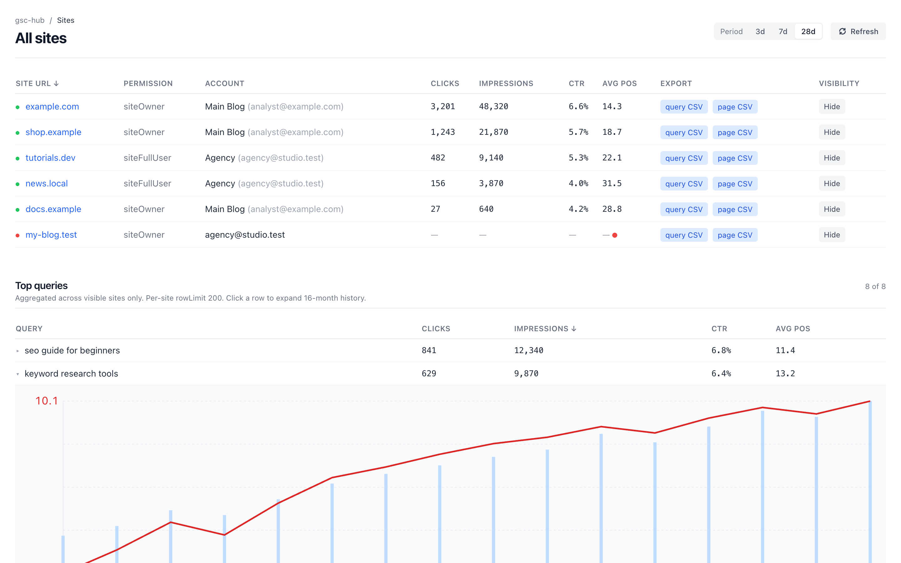
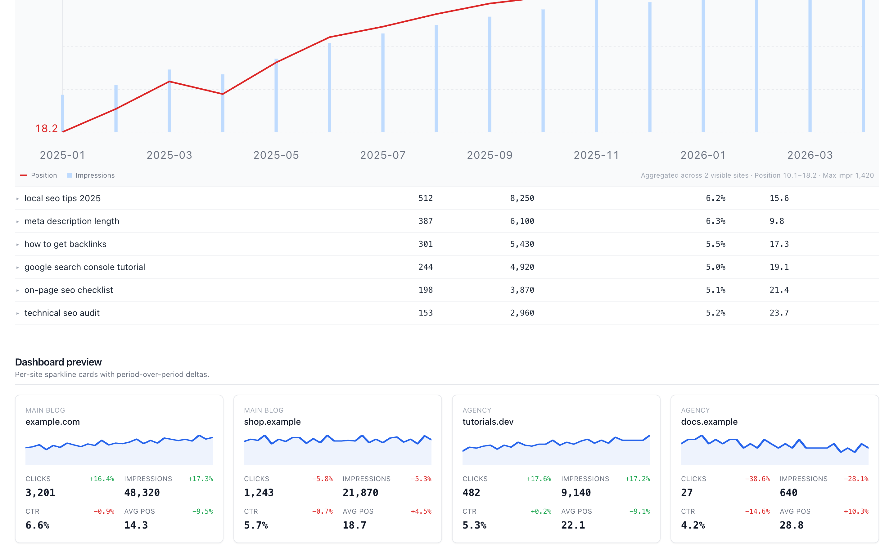
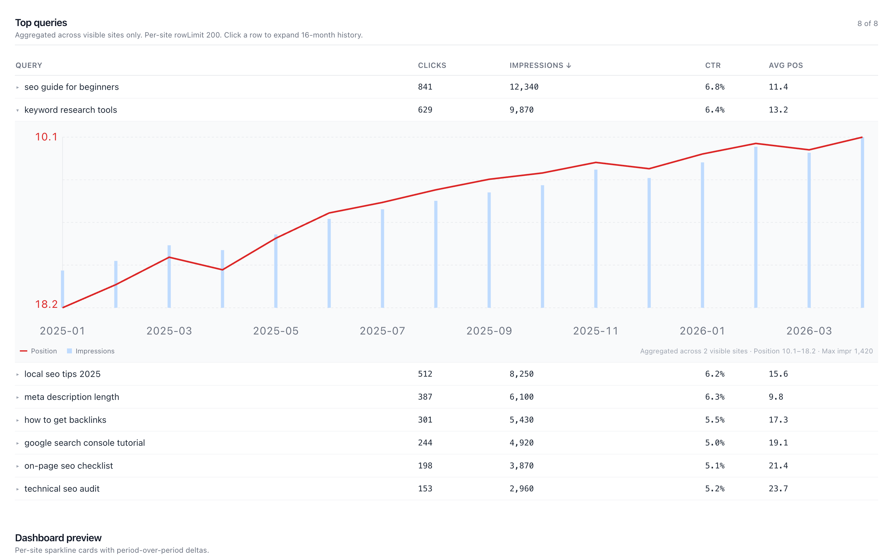

# gsc-hub

> [Русская версия](README.ru.md)

## Screenshots

| Sites table — multi-account aggregation | Dashboard — sparkline cards |
|---|---|
|  |  |



Local self-hosted multi-account hub for **Google Search Console**. Connect several Google accounts via OAuth, view all Search Console sites in a single table, aggregate queries and pages across accounts, see per-site dashboards with sparklines and period-over-period deltas, drill into 16-month query history with one click. No external service, no GSC data leaves your machine, only OAuth tokens persist locally in SQLite.

Built as a personal alternative to seogets-style SaaS tools when you have multiple Google accounts (personal, work, clients) and don't want to log in to each Search Console separately.

> **Status:** working MVP, used daily on macOS. Ships with a Docker Compose + OrbStack deploy served at `https://gsc.local`. Accounts are connected over `http://localhost:5173` because Google rejects OAuth redirects to `.local` domains (see [Deploying](#deploying-with-docker-compose--orbstack)).

## Features

### Multi-account OAuth
- Connect any number of Google accounts. Each click on **Connect Google account** runs a normal Google consent flow (`webmasters` read-write scope, `access_type=offline`, `prompt=consent`). The read-write scope is required to submit sitemaps; if you only need read access, change `src/auth.ts` back to `webmasters.readonly`.
- Tokens are stored in a local SQLite file (`./data/gsc-hub.db`). Refresh tokens auto-rotate; access tokens are refreshed transparently 60 seconds before they expire.
- Revoked tokens detected via the first 401 from Google: account is marked `revoked`, UI prompts reconnect, no silent failures.

### Unified sites table (`/properties`, displayed as **Sites**)
- All Search Console properties from all connected accounts, in one full-bleed table.
- Per-site live aggregate for the selected period: **Clicks / Impressions / CTR / Avg Pos**, plus a **CSV export** column (queries or pages, configurable period).
- URL-driven sort and filter: `?days=1|3|7|28|60&sort=clicks|impressions|ctr|position|site|account&dir=asc|desc`. Bookmark, share, browser-back work as expected.
- A **"G" badge** next to each site opens a Google `site:` search for a quick manual indexation check.
- Hide sites you don't care about (kept in localStorage per browser; doesn't sync).
- Domain properties displayed as `example.com` (the `sc-domain:` GSC prefix is stripped for display, link still goes to `https://example.com/`).
- Click any site row to expand a quick **URL Inspection** report for its top 10 URLs (verdict, coverage, robots, last crawl, canonical mismatch). Uses Google's URL Inspection API; daily quota is 2000 per Google account. Results are cached for **12 hours** in SQLite (key: account + site + url-set hash). Re-clicking the same site reuses the cache; **Force refresh** button bypasses it. The cache exists because URL Inspection has a hard 2000-call/day quota per Google account. Sites with no/low impressions in the current period fall back to URLs from their **sitemap**: gsc-hub asks Search Console which sitemaps the site submitted, downloads the first one (following sitemapindex if needed), and uses up to 10 page URLs from there. The homepage is always included.

### Sitemap submit
- **Submit sitemap** button per site: resubmits every sitemap Search Console already knows for that property, falling back to a guessed `/sitemap.xml` if none are registered. Inline status (`✓ N` / failure reason in the tooltip).
- **Submit all sitemaps** button in the toolbar: fans out across all visible (non-hidden) sites in parallel, with progress and an aggregate result.
- Requires the read-write `webmasters` scope (see Multi-account OAuth).

### Top queries (aggregated, sortable)
- Aggregated query-level rollup across all visible (non-hidden) sites for the selected period, broken down by **query × page × country**. Clicks, impressions, CTR (computed), Avg Pos (impression-weighted).
- Click the position cell to open the **Google SERP** for that query in the matching country.
- Click a row to expand a **16-month inline history chart** for that exact query: red position line + blue impression bars, gridlines, axis range labels. Aggregated by day across visible sites only.
- Client-side column sort (Query / Clicks / Impressions / CTR / Avg Pos), independent from the sites-table sort.

### Top pages (aggregated, sortable)
- Same pattern as Top queries, but at page-URL granularity. Useful for finding the URL that pulled a sudden spike.

### Dashboard (`/dashboard`)
- Grid of per-site cards: account label, site, sparkline of daily clicks for the current period, four metrics with **deltas vs the previous period of the same length** (e.g., last 7 days vs the 7 days before that). Green/red, also dual-encoded with `+` / `−` so colour-blind users get the signal.
- Configurable density: **2 / 4 / 6 columns** via URL `?cols=`. Same period filter as Sites.
- Stable order across reloads (clicks desc, impressions tiebreaker, then alphabetical).

### CSV exports
- Queries or pages, last N days (matches the period filter), sanitized filename. Streams `text/csv; charset=utf-8` with `Content-Disposition: attachment`. Downloaded directly from `/properties/export?account=...&site=...&days=...&dim=query|page`.

### Operator-grade UX details
- **Refresh** preserves all URL state (period, sort, dir, cols) via SvelteKit's `invalidateAll()`. No `<form method="POST">` redirect dance.
- All numbers in tables are tabular-nums for vertical alignment.
- Light hover affordance on rows. Sortable headers show ↑ / ↓.
- **No data is cached server-side.** Every page load is a live fan-out across active accounts. The cost is honest latency. The benefit is you see exactly what GSC sees, right now.
- No background jobs, no cron, no queues, no email.

## Quickstart

Requirements: **Node 22+**, **pnpm**.

```bash
git clone https://github.com/izzipizzy/gsc-hub.git
cd gsc-hub
pnpm install
cp .env.example .env
# fill in GOOGLE_CLIENT_ID, GOOGLE_CLIENT_SECRET, AUTH_SECRET
pnpm dev
```

Open <http://localhost:5173>, click **Connect Google account**, complete consent, repeat for each account you want to connect.

For a long-running local deploy, use Docker Compose instead — see [Deploying with Docker Compose + OrbStack](#deploying-with-docker-compose--orbstack).

> **Connect accounts over `http://localhost:5173`, not `https://gsc.local`.** Google's OAuth policy rejects redirects to the `.local` TLD (`Error 400: invalid_request`). The Compose setup exposes a loopback port specifically so the consent flow can run on localhost; day-to-day you can still use `https://gsc.local`. The SQLite DB is shared, so a token obtained on localhost works on `gsc.local` too.

## Google Cloud setup

1. Open <https://console.cloud.google.com/apis/credentials>.
2. **Create credentials** → **OAuth client ID** → Application type **Web application**, name `gsc-hub`.
3. Authorized redirect URIs:
   - `http://localhost:5173/auth/callback/google` (dev)
   - `https://your-domain.example/auth/callback/google` (only if you deploy)
4. Enable the **Search Console API** in the same project: <https://console.cloud.google.com/apis/library/searchconsole.googleapis.com>.
5. **OAuth consent screen** (now under **Google Auth Platform → Audience**): set User Type to **External**. Either **Publish** the app (any Google account can sign in) or keep it in **Testing** and add your Google emails as Test users.
6. Copy the Client ID and Client Secret into `.env`. Generate `AUTH_SECRET` via `openssl rand -base64 32`.

The `webmasters` scope is a "sensitive scope" in Google's classification, but Google does not require formal verification for personal-tier usage (the OAuth user cap allows up to 100 consenting users for unverified sensitive scopes). You'll see an "unverified app" warning on the consent screen; click **Advanced → Go to gsc-hub (unsafe)** to proceed. Only register `http://localhost:5173/auth/callback/google` as the redirect URI — Google will not accept a `.local` redirect.

## Configuration

`.env` keys (see `.env.example`):

| key | required | description |
|-----|----------|-------------|
| `GOOGLE_CLIENT_ID` | yes | OAuth Web Application client ID |
| `GOOGLE_CLIENT_SECRET` | yes | OAuth Web Application client secret |
| `AUTH_SECRET` | yes | Random 32-byte base64 secret for Auth.js (`openssl rand -base64 32`) |
| `AUTH_TRUST_HOST` | recommended | `true` for self-hosted/proxy setups |
| `DB_PATH` | optional | Path to SQLite file. Defaults to `./data/gsc-hub.db` |

## Architecture

```
[browser] ──┬─ https://gsc.local (OrbStack proxy, TLS) ──┐
            └─ http://localhost:5173 (loopback, for OAuth)┴─> [SvelteKit (Node) :3000] ──> Google Search Console API
                                                                       │
                                                                       └──> ./data/gsc-hub.db  (only OAuth tokens)
```

One Node process. One SQLite file. The DB schema has two tables:

```sql
CREATE TABLE google_accounts (
  id            TEXT PRIMARY KEY,    -- google sub
  email         TEXT NOT NULL,
  label         TEXT,
  access_token  TEXT NOT NULL,
  refresh_token TEXT NOT NULL,
  expires_at    INTEGER NOT NULL,
  scope         TEXT NOT NULL,
  status        TEXT NOT NULL DEFAULT 'active',  -- active | revoked | error
  last_error    TEXT,
  added_at      INTEGER NOT NULL
);

CREATE TABLE url_inspection_cache (
  account_id   TEXT NOT NULL,
  site_url     TEXT NOT NULL,
  urls_hash    TEXT NOT NULL,
  fetched_at   INTEGER NOT NULL,
  payload      TEXT NOT NULL,
  PRIMARY KEY (account_id, site_url, urls_hash)
);
```

**No GSC analytics data is persisted.** Every request to `/properties`, `/dashboard`, the query-history endpoint or the CSV export does a fresh fan-out to Google. Hidden sites are kept in browser localStorage only.

This keeps things simple, eliminates a "stale data" UX class, and means the database file you care about is tiny (a few KB per account). The trade-off is page-load latency proportional to the number of active sites: roughly 2N parallel API calls for the sites view, 3N for the dashboard, 1N for query history.

### Auth.js custom signIn callback

Auth.js v5 is wired with a custom `signIn` callback that, instead of creating an app session, **upserts the Google profile + tokens into `google_accounts`** keyed by `profile.sub`, then returns `'/'` to redirect cleanly without setting a session cookie. The app has no concept of "logged-in user" beyond local trust (single-user tool, defended by `127.0.0.1` binding in dev).

## Tech stack

- [SvelteKit](https://kit.svelte.dev/) (Svelte 5 runes) + TypeScript, Node adapter
- [Auth.js](https://authjs.dev/) (`@auth/sveltekit`) for the Google OAuth dance
- [better-sqlite3](https://github.com/WiseLibs/better-sqlite3) for the local token store
- [TailwindCSS v3](https://tailwindcss.com/) for styles (no custom palette extension; tokens documented in [DESIGN.md](DESIGN.md))
- [Vitest](https://vitest.dev/) for unit tests

No chart libraries: every sparkline and the query-history chart are hand-rolled SVG (`<rect>` + `<path>`). No icon fonts: every icon is a 14×14 inline SVG.

## Project layout

```
gsc-hub/
├── PRODUCT.md             — strategic context (users, principles, anti-references)
├── DESIGN.md              — visual system (colors, typography, components, rules)
├── DESIGN.json            — sidecar with HTML/CSS snippets per component
├── CLAUDE.md              — instructions for AI assistants working in this repo
├── Dockerfile             — multi-stage production image (Node runtime)
├── compose.yaml           — Docker Compose: OrbStack domain + loopback port 5173
├── src/
│   ├── auth.ts            — SvelteKitAuth config + custom signIn callback
│   ├── hooks.server.ts
│   ├── app.css            — Tailwind + Operator Console utilities
│   ├── lib/
│   │   ├── server/
│   │   │   ├── db.ts               — SQLite open + migration
│   │   │   ├── accounts.ts         — CRUD over google_accounts (only file with SQL for that table)
│   │   │   ├── inspection_cache.ts — 12h SQLite cache for URL Inspection responses
│   │   │   ├── google.ts           — GSC client, refresh, fan-out, search analytics
│   │   │   └── csv.ts              — RFC 4180 CSV writer
│   │   └── utils/
│   │       ├── site.ts            — strip sc-domain: prefix, build proper href + Google site: search
│   │       └── country.ts         — map GSC country codes to Google SERP URLs
│   └── routes/
│       ├── +page.svelte           — Accounts list (/)
│       ├── auth/[...auth]/        — Auth.js catch-all
│       ├── accounts/[id]/         — delete, relabel
│       └── properties/
│           ├── +page.svelte       — Sites table + Top queries + Top pages
│           ├── export/+server.ts        — CSV stream
│           ├── inspect/+server.ts       — URL Inspection (cached)
│           ├── refresh/+server.ts       — force-refresh helpers
│           ├── sitemap-urls/+server.ts  — fetch sitemap URLs for inspection fallback
│           ├── sitemap-submit/+server.ts — (re)submit sitemaps to GSC
│           └── query-history/+server.ts — 16-month per-query history
├── tests/                          — Vitest, mocks fetch/env
└── data/gsc-hub.db                 — gitignored, created on first run
```

## Commands

| command | description |
|---|---|
| `pnpm dev` | Dev server on http://localhost:5173 |
| `pnpm build` | Production build (Node target) |
| `pnpm preview` | Preview the production build |
| `pnpm test` | Run Vitest |
| `pnpm test:watch` | Watch mode |
| `pnpm check` | `svelte-check` type-check |
| `docker compose up -d --build` | Build and run the production container (OrbStack) |
| `docker compose logs -f gsc` | Follow container logs |
| `docker compose down` | Stop and remove the container (data in `./data` persists) |

## Tests

39 unit tests cover the server modules:
- SQLite migration and schema, including `url_inspection_cache` table (`tests/db.test.ts`)
- URL Inspection cache: hash determinism, miss, hit, TTL expiry, upsert, delete (`tests/inspection_cache.test.ts`)
- Accounts CRUD including `markActive` / `markRevoked` / `markError` (`tests/accounts.test.ts`)
- GSC client: token refresh skew window, 5xx → markError, 401/invalid_grant → markRevoked, fan-out aggregation, per-site queries / pages / daily breakdown / query-history (`tests/google.test.ts`)
- Sitemap URL fetching and parsing (`tests/sitemap.test.ts`)
- RFC 4180 CSV escaping (`tests/csv.test.ts`)

Routes are not unit-tested; smoke-tested via `curl` against `pnpm dev`.

## Privacy and data handling

- The only data persisted on your machine is the OAuth token row per connected Google account.
- No Search Console data (queries, clicks, impressions, page URLs, ranking positions) is ever written to disk.
- No analytics, no telemetry, no outbound calls except to Google's APIs.
- The SQLite file lives in `./data/` (gitignored). Delete it to wipe all connections.
- Tokens are stored in plaintext. This is acceptable for a local single-user tool; encrypt at rest if you ever expose this beyond `127.0.0.1`.
- The exception is the URL Inspection cache (`url_inspection_cache` table) which stores response payloads keyed by `(account_id, site_url, urls_hash)` for 12 hours, to avoid burning the daily 2000-call quota on repeat clicks. Delete `data/gsc-hub.db` to wipe it.

## Deploying with Docker Compose + OrbStack

The repo ships a `Dockerfile` (multi-stage, Node runtime) and a `compose.yaml` tuned for [OrbStack](https://orbstack.dev/) on macOS:

```bash
docker compose up -d --build   # build and start
docker compose logs -f gsc     # follow logs
docker compose restart gsc     # restart
docker compose down            # stop (data in ./data persists)
```

- Served at **`https://gsc.local`** via the OrbStack proxy (automatic TLS) — set by the `dev.orbstack.domains` label. Also reachable at `https://gsc.orb.local` (auto domain by container name).
- `restart: unless-stopped` brings the container back after a reboot (OrbStack starts on login).
- The container also binds **`127.0.0.1:5173 → 3000`** (loopback only). This exists solely so the OAuth flow can run on `http://localhost:5173` — Google rejects `.local` redirects. Use this URL to connect accounts; use `https://gsc.local` for everyday work.
- `.env` is read via `env_file`; secrets are injected at runtime through `$env/dynamic/private`, not baked into the image.
- `./data` is bind-mounted, so the SQLite token store survives rebuilds and is shared with `pnpm dev`.

**Security note:** the app has no built-in authentication (single-user tool). The port is intentionally bound to `127.0.0.1` only — do not expose it on `0.0.0.0` or the network, since the DB holds Google OAuth tokens. To publish on a public hostname, front it with an identity-aware proxy (e.g. Cloudflare Access) limited to your email, and add the production callback URL to your Google OAuth client.

## Roadmap (Phase B, not yet shipped)

- Daily background pull of aggregates into Postgres for trends and period comparisons that span weeks/months without re-querying GSC each time.
- Charts with hover tooltips on the dashboard cards.
- URL Inspection bulk + sitemap monitoring.
- Alerts on traffic drops.

The MVP is intentionally cache-free; phase B will add a cache when usage shows it's needed. Until then, every load is fresh.

## License

MIT. See [LICENSE](LICENSE).
