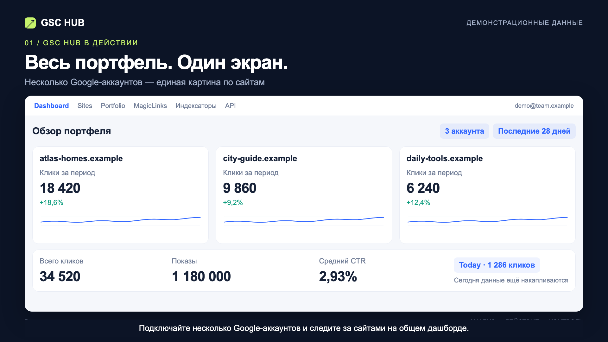

# gsc-hub

> [Русская версия](README.ru.md)

## Video demo

[](docs/videos/gsc-hub-demo.mp4)

[Watch / download MP4](docs/videos/gsc-hub-demo.mp4) · [Russian subtitles](docs/videos/gsc-hub-demo.ru.srt)

90 seconds, Full HD, Russian narration. All domains, accounts and metrics are synthetic.

## Screenshots


| All sites — multi-account, sparklines, Bing/IndexNow | Dashboard — site cards with a separate Today |
|---|---|
|  |  |


Local self-hosted multi-account hub for **Google Search Console**. Connect several Google accounts via OAuth, view all Search Console sites in a single table, aggregate queries and pages across accounts, see per-site dashboards with sparklines and period-over-period deltas, drill into 16-month query history with one click. Since 0.6.0 it also ships a full **SEO analytics suite** — per-site deep-dives (striking distance, cannibalization, CTR benchmark, content decay, branded split, site health) and a portfolio-wide view across all sites — plus Bing/IndexNow and optional multi-user login. Since 0.8.0: traffic charts annotated with Google updates and your own site events, a site-scoped machine API with a built-in **MCP server** for AI agents, and optional link buying straight from striking-distance tables. Since 0.9.0: saved URL exclusions and filters, sorting and remembered site preferences, purchases on a custom page path, weekly backlink monitoring with provider pulse history, and page/sitemap submissions through NeuralIndexer. The [video walkthrough](docs/videos/gsc-hub-demo.mp4) uses synthetic data. Search Analytics metrics stay on your machine, fetched live with a short in-memory cache. Optional link buying and indexing send selected queries or URLs to the configured provider; backlink checks request donor pages. SQLite stores tokens, settings and operational records described under [Privacy](#privacy-and-data-handling).

The interface is Russian-first: navigation and table headers are English, many buttons and messages are Russian.

Built as a personal alternative to seogets-style SaaS tools when you have multiple Google accounts (personal, work, clients) and don't want to log in to each Search Console separately.

> **Status:** working MVP, used daily on macOS. Ships with a Docker Compose + OrbStack deploy served at `https://gsc.local`. Accounts are connected over `http://localhost:5173` because Google rejects OAuth redirects to `.local` domains (see [Deploying](#deploying-with-docker-compose--orbstack)).

## Features

### Multi-account OAuth
- Connect any number of Google accounts. Each click on **Connect Google account** runs a normal Google consent flow (`webmasters` read-write scope, `access_type=offline`, `prompt=consent`). The read-write scope is required to submit sitemaps; if you only need read access, change `src/auth.ts` back to `webmasters.readonly`.
- Tokens are stored in a local SQLite file (`./data/gsc-hub.db`). Refresh tokens auto-rotate; access tokens are refreshed transparently 60 seconds before they expire.
- Revoked tokens detected via the first 401 from Google: account is marked `revoked`, UI prompts reconnect, no silent failures.

### Unified sites table (`/properties`, displayed as **Sites**)
- All Search Console properties from all connected accounts, in one full-bleed table.
- Per-site live aggregate for the selected period: **Clicks / Impressions / CTR / Avg Pos**, plus a **CSV export** column (queries or pages, configurable period).
- A **totals bar** above the table sums **Sites / Impressions / Clicks** across all non-hidden sites for the selected period.
- URL-driven sort and filter: `?days=1|3|7|28|60&sort=clicks|impressions|ctr|position|site|account&dir=asc|desc`. Bookmark, share, browser-back work as expected.
- A **"G" badge** next to each site opens a Google `site:` search for a quick manual indexation check.
- Hide sites you don't care about. The list lives in SQLite, so it is the same in every browser and bulk actions skip hidden sites.
- Domain properties displayed as `example.com` (the `sc-domain:` GSC prefix is stripped for display, link still goes to `https://example.com/`).
- Click any site row to expand a quick **URL Inspection** report for its top 10 URLs (verdict, coverage, robots, last crawl, canonical mismatch). Uses Google's URL Inspection API; daily quota is 2000 per Google account. Results are cached for **12 hours** in SQLite (key: account + site + url-set hash). Re-clicking the same site reuses the cache; **Force refresh** button bypasses it. The cache exists because URL Inspection has a hard 2000-call/day quota per Google account. Sites with no/low impressions in the current period fall back to URLs from their **sitemap**: gsc-hub asks Search Console which sitemaps the site submitted, downloads the first one (following sitemapindex if needed), and uses up to 10 page URLs from there. The homepage is always included.

### Sitemap submit
- **Submit sitemap** button per site: resubmits every sitemap Search Console already knows for that property, falling back to a guessed `/sitemap.xml` if none are registered. Inline status (`✓ N` / failure reason in the tooltip).
- **Submit all sitemaps** button in the toolbar: fans out across all visible (non-hidden) sites in parallel, with progress and an aggregate result.
- Requires the read-write `webmasters` scope (see Multi-account OAuth).

### Top queries (aggregated, sortable)
- Aggregated query-level rollup across all visible (non-hidden) sites for the selected period, broken down by **query × page × country**. Clicks, impressions, CTR (computed), Avg Pos (impression-weighted).
- Click the position cell to open the **Google SERP** for that query in the matching country.
- Click a row to expand a **16-month inline history chart** for that exact query: red position line + blue impression bars, gridlines, axis range labels. Aggregated by day across visible sites only.
- Client-side column sort (Query / Clicks / Impressions / CTR / Avg Pos), independent from the sites-table sort.

### Top pages (aggregated, sortable)
- Same pattern as Top queries, but at page-URL granularity. Useful for finding the URL that pulled a sudden spike.

### Per-site analytics (`/properties/[site]`)
Click through to a single property for a full SEO deep-dive. Tabs:
- **Striking Distance** — queries ranking at positions 4–20 with real impressions: the fastest wins to page 1.
- **Keyword Cannibalization** — queries where several of your own URLs compete, with a clear winner/loser breakdown.
- **CTR Benchmark** — your actual click-through rate by position vs an industry-reference curve, plus the pages that under-perform it.
- **Content Decay** — pages losing clicks **or** impressions vs the previous period.
- **Branded vs non-branded** — traffic split, with editable brand terms per site.
- **Site Health** — SSL (expiry / issuer / grade), Google Safe Browsing, and Core Web Vitals (PageSpeed Insights, mobile). Run on demand, cached per site. Needs a Google API key (see [Configuration](#configuration)); the tab stays hidden without one.

All tabs are computed live from Search Console; nothing is persisted beyond the editable brand terms and the health cache.

### Portfolio analytics (`/properties/striking`, **Portfolio** in the top menu)
The same lenses across every non-hidden site at once, computed from a single query fan-out:
- Tabbed **Striking / Cannibalization / CTR / Branded / Decay**, all **URL-addressable** via `?tab=`.
- **Country (Geo) filter** and **copy-queries-to-clipboard**, both respecting the current filter.
- Per-decaying-page **index status** via the URL Inspection API, with a direct link into the owning Google account's inspection panel.
- Async streaming (the shell renders immediately) plus a short in-memory result cache, so re-opens and period switches are instant.

### Traffic charts and site events
- The site page draws a full traffic chart (clicks, impressions, position) with **Google ranking updates** shaded in, taken from Google's public status feed.
- The Sites page opens with a **portfolio pulse**: all visible sites summed per day, on the same update bands.
- **Site events** are your own markers - domain merges (donor → site), migrations, anything worth seeing on the timeline. Add and remove them on the site page; they show up on the charts and dashboard cards. `/events` lists all of them in one table. Link purchases are included automatically from Magiclinks history: one purple marker per order and site, with the ordered quantity, provider and an order link. The marker uses the purchase date (UTC), not the placement date; historical orders appear without a migration.

### Bing Webmaster + IndexNow
- Bing performance data alongside GSC, with merged GSC/Bing keyword rollups.
- **Submit sitemap to Bing** and **push URLs to IndexNow**, plus an IndexNow-key indicator per site.
- Requires `BING_API_KEY` (see [Configuration](#configuration)).

### Machine API (`/api`)
- Create API keys on `/api`. A key is shown once; only its sha256 is stored. Each key can be limited to a list of sites - everything else is invisible to it (`404`, not `403`).
- `GET /api/v1/sites`, `/queries`, `/query-pages`, `/properties`, `/countries`, `/site-countries` give a script or a SERP monitor the same numbers the UI shows. `POST /api/v1/site-events` records a domain merge.
- Agent-facing documentation is served at `/api/v1/doc.md` (with a key).

### MCP server & agent skills

- A built-in **MCP server** at `/api/v1/mcp`: Claude Code, Claude Desktop, Cursor
  or any Streamable-HTTP MCP client reads your Search Console data directly.
  Nine **read-only** tools - portfolio summary, per-site queries, pages for a
  query, striking distance, cannibalization, CTR benchmark, content decay,
  country split and domain-merge events.
- **Keys are scoped to sites.** Create as many keys as you need on `/api` and
  tick which properties each one may see: an agent working on one pool, a
  contractor on a single site. Everything outside the scope is invisible -
  missing from lists, `404` when asked for by name. A key with nothing ticked
  sees all sites, which is how keys behaved before scopes existed.
- The MCP surface never writes: no merges, no purchases, no edits, so an agent
  talking MCP cannot change anything or spend money. The key itself is not
  read-only, though: the same Bearer is accepted by the REST endpoint
  `POST /api/v1/site-events`, which records a domain merge on a site in the
  key's scope. Hand out keys with that in mind.
- **Four agent skills** ship with the hub (striking plan, cannibalization,
  decay triage, portfolio review). They are served by the same instance as MCP
  prompts - `/mcp__gsc-hub__gsc-striking-plan` in Claude Code - and as files over
  `/api/v1/skills`, so installing them needs a key and a URL, not a copy of this
  repository. See [docs/MCP-SETUP.md](docs/MCP-SETUP.md).

```bash
claude mcp add --transport http gsc-hub https://your-hub.example.com/api/v1/mcp \
  --header "Authorization: Bearer gsk_your_key"
```

### Link buying (MagicLinks, optional)
- Buy posts with links to pages that sit in striking distance, straight from the striking tables (portfolio and per site): tick rows, get a quote, pay. Two providers are supported, and the purchase window picks the one with the larger balance by default:
  - **FieldLink** - two-step purchase (task → quote → order), the quoted amount is re-checked when the order is sent. [Sign up](https://seoboost-root.info/r/flt_czhTpL1GKPqQXI2h1c463ULMS2IEzV6fjJow2hiGlMg) (referral link), then create an API key in the dashboard.
  - **369Team** (`magiclinks.online`) - one-step purchase, charged when the order is created; the price is re-checked right before. For an account and an API key, message [@links_369](https://t.me/links_369) on Telegram.
- `/magiclinks` holds both keys, balances and every order with its provider, progress and (for FieldLink) search-indexing status; each order opens to its positions and published URLs, with a CSV export.
- Service data is never cached: orders and statuses are read live. The hub keeps only the keys and a purchase trail (which query/URL pairs were already bought), so striking tables can mark them.
- Nothing here is on by default - without a key the feature stays out of the way.
- Disclosure: both integrations are affiliate ones. The FieldLink sign-up link is a referral link, and requests to 369Team carry the author's referral ID (`X-Referal-ID`).

### Optional login & roles
- **Off by default** — the tool stays single-user and loopback-only. Set `ADMIN_EMAIL` / `ADMIN_PASSWORD` to turn on a login form, server sessions (argon2-hashed passwords), a user-management page, and roles (**admin** / **manager**) with per-owner account scoping.
- Intended for when you expose the app beyond `127.0.0.1`; secure cookies switch on automatically once `ORIGIN` starts with `https://`.

### Dashboard (`/dashboard`)
- A separate **Today** block: the current day in Search Console's timezone, still accumulating, deliberately not compared with anything.
- Grid of per-site cards: account label, site, sparkline of daily clicks for the current period, four metrics with **deltas vs the previous period of the same length** (e.g., last 7 days vs the 7 days before that). Green/red, also dual-encoded with `+` / `−` so colour-blind users get the signal.
- Configurable density: **2 / 4 / 6 columns** via URL `?cols=`. Same period filter as Sites.
- Stable order across reloads (clicks desc, impressions tiebreaker, then alphabetical).

### CSV exports
- Queries or pages, last N days (matches the period filter), sanitized filename. Streams `text/csv; charset=utf-8` with `Content-Disposition: attachment`. Downloaded directly from `/properties/export?account=...&site=...&days=...&dim=query|page`.

### Operator-grade UX details
- **Sparklines** of daily clicks on the site cards.
- **Privacy Blur** — one click blurs PII (emails, domains, metrics) for screenshots and screen-sharing.
- **Refresh** preserves all URL state (period, sort, dir, cols) via SvelteKit's `invalidateAll()`. No `<form method="POST">` redirect dance.
- All numbers in tables are tabular-nums for vertical alignment.
- Light hover affordance on rows. Sortable headers show ↑ / ↓.
- **Short in-memory cache.** Search Console responses are kept in process memory for up to 60 minutes, so page switches are fast and quota lasts; **Refresh** drops the cache, and a restart starts cold. Search Analytics responses never reach the database; the disk exceptions (URL Inspection cache, bought query + URL pairs) are listed under [Privacy](#privacy-and-data-handling).
- Purchased backlinks are checked in a persistent background queue, weekly by default, once link-buying providers are configured. Disable automatic checks in MagicLinks settings or set `BACKLINK_AUTO_ENABLED=0`; manual checks remain available. No email notifications.

## Quickstart

Requirements: **Node 22+**, **pnpm**.

```bash
git clone https://github.com/izzipizzy/gsc-hub.git
cd gsc-hub
pnpm install
pnpm dev
```

Open <http://localhost:5173> — the **setup wizard** opens on first run and asks for your Google Client ID/Secret; `AUTH_SECRET` is generated automatically, no manual `.env` editing needed. (Copying `.env.example` to `.env` is optional, only needed for automated/CI setups — see [Configuration](#configuration).) Click **Connect Google account**, complete consent, repeat for each account you want to connect.

For a long-running local deploy, use Docker Compose instead — see [Deploying with Docker Compose + OrbStack](#deploying-with-docker-compose--orbstack).

> **Connect accounts over `http://localhost:5173`, not `https://gsc.local`.** Google's OAuth policy rejects redirects to the `.local` TLD (`Error 400: invalid_request`). The Compose setup exposes a loopback port specifically so the consent flow can run on localhost; day-to-day you can still use `https://gsc.local`. The SQLite DB is shared, so a token obtained on localhost works on `gsc.local` too.

### Quick start (setup wizard)

1. `docker compose up -d --build`
2. Open the app (`http://localhost:5173` for connecting Google accounts).
3. The **setup wizard** opens automatically: paste your Google **Client ID** and
   **Client Secret** (the page shows the exact redirect URI to register in GCP),
   choose access mode (loopback-only or exposed-with-login), and save. No manual
   `.env` editing — `AUTH_SECRET` is generated for you and stored in SQLite.

If the app will be reachable from other machines, set `GOOGLE_CLIENT_ID`,
`GOOGLE_CLIENT_SECRET`, `ADMIN_EMAIL` and `ADMIN_PASSWORD` in the environment
before exposing it (or finish the wizard over loopback first, with login
enabled). An exposed instance without Google credentials, a login and an admin
answers `503` to everything - the anonymous wizard and single-user mode are
loopback-only. The bundled `compose.yaml` sets `EXPOSED_MODE=0`, which declares
the OrbStack network trusted and keeps single-user mode; drop it if that network
is not yours alone.

The detailed GCP OAuth walkthrough below is only needed to obtain the two values
the wizard asks for. Everything under "Configuration" is optional / for automated
deploys (env vars take precedence over wizard values).


## Google Cloud setup

1. Open <https://console.cloud.google.com/apis/credentials>.
2. **Create credentials** → **OAuth client ID** → Application type **Web application**, name `gsc-hub`.
3. Authorized redirect URIs:
   - `http://localhost:5173/auth/callback/google` (dev)
   - `https://your-domain.example/auth/callback/google` (only if you deploy)
4. Enable the **Search Console API** in the same project: <https://console.cloud.google.com/apis/library/searchconsole.googleapis.com>.
5. **OAuth consent screen** (now under **Google Auth Platform → Audience**): set User Type to **External**. Either **Publish** the app (any Google account can sign in) or keep it in **Testing** and add your Google emails as Test users.
6. Copy the Client ID and Client Secret — paste them into the **setup wizard** when you first open the app. `AUTH_SECRET` needs no manual step; the wizard generates and stores it in SQLite.

The `webmasters` scope is a "sensitive scope" in Google's classification, but Google does not require formal verification for personal-tier usage (the OAuth user cap allows up to 100 consenting users for unverified sensitive scopes). You'll see an "unverified app" warning on the consent screen; click **Advanced → Go to gsc-hub (unsafe)** to proceed. Only register `http://localhost:5173/auth/callback/google` as the redirect URI — Google will not accept a `.local` redirect.

## Configuration

`.env` keys (see `.env.example`):

| key | required | description |
|-----|----------|-------------|
| `GOOGLE_CLIENT_ID` | yes | OAuth Web Application client ID |
| `GOOGLE_CLIENT_SECRET` | yes | OAuth Web Application client secret |
| `AUTH_SECRET` | yes | Random 32-byte base64 secret for Auth.js (`openssl rand -base64 32`) |
| `AUTH_TRUST_HOST` | recommended | `true` for self-hosted/proxy setups |
| `DB_PATH` | optional | Path to SQLite file. Defaults to `./data/gsc-hub.db` |
| `PAGESPEED_KEY` | optional | Google API key for the Site Health tab (Core Web Vitals via PageSpeed Insights). Enable the **PageSpeed Insights API**. One Google API key can serve both Health checks. |
| `GOOGLE_SAFE_BROWSING_KEY` | optional | Google API key for the Site Health tab's Safe Browsing check. Enable the **Safe Browsing API** — the same key as `PAGESPEED_KEY` works. Without these two, the Health tab stays hidden; nothing else needs them. |
| `BING_API_KEY` | optional | Bing Webmaster API key — enables Bing data, "Submit to Bing", and IndexNow push. |
| `SERP_API_TOKEN` | optional | Shared token the SERP monitor presents to `GET /api/v1/sites` and `GET /api/v1/queries`. Keys created on `/api` are accepted as well; with neither, the machine API rejects every request - it is never open. |
| `SERP_MONITOR_URL` | optional | Base URL of the SERP monitor (e.g. `https://serp.example.com`). Enables the real-position column and the "check now" button on a site page. |
| `SERP_MONITOR_TOKEN` | optional | Token this hub presents to the SERP monitor. Without it the site page says the integration is off rather than claiming the site is not monitored. |
| `MAGICLINKS_API_TOKEN` | optional | FieldLink key for link buying. Usually entered on `/magiclinks` instead; the env var wins over the stored one. |
| `MAGIC369_API_TOKEN` | optional | 369Team key for link buying, same rules. Keys are issued via [@links_369](https://t.me/links_369). |
| `GSC_CONCURRENCY` | optional | Concurrent Search Console calls per fan-out. Defaults to `8`. Guards the local socket pool — unbounded, a ~200-site account times out the whole batch. Lower it if you still see connect timeouts. |
| `GSC_INSPECT_CONCURRENCY` | optional | Concurrent URL Inspection calls. Defaults to `4` — lower on purpose, since inspection is capped by quota (2000/day and 600/min per property), not by sockets. |
| `ADMIN_EMAIL` / `ADMIN_PASSWORD` | optional | Set both to enable multi-user login/roles (seeds an admin on first start). Leave unset for the default single-user, loopback-only mode. |
| `EXPOSED_MODE` | optional | `1` forces the app to treat itself as reachable by other machines, `0` accepts the risk on a trusted network. Left unset it is inferred from the configured origin and the request host — only loopback counts as local. An exposed app with no login configured returns 503 rather than falling back to single-user local admin. |
| `UPDATE_CHECK` | optional | `off` disables the update check — the browser stops contacting `api.github.com`; the version stays in the footer. Enabled by default. |
| `ORIGIN` | optional | Public origin (e.g. `https://your-domain.example`). Enables secure cookies when it starts with `https://`. |
| `AUTH_URL` | optional | Public URL Auth.js uses to build the OAuth redirect; must match the GCP OAuth redirect base. |

## Architecture

```
[browser] ──┬─ https://gsc.local (OrbStack proxy, TLS) ──┐
            └─ http://localhost:5173 (loopback, for OAuth)┴─> [SvelteKit (Node) :3000] ──> Google Search Console API
                                                                       │
                                                                       └──> ./data/gsc-hub.db  (only OAuth tokens)
```

One Node process. One SQLite file. Tables are created and migrated at startup:

| table | holds |
|---|---|
| `google_accounts` | OAuth tokens of connected Google accounts |
| `users`, `sessions` | optional login (argon2 hashes, server sessions) |
| `app_config` | settings from the setup wizard and service keys (env wins over the DB) |
| `api_keys` | machine API keys: sha256 hash, prefix and site scope |
| `hidden_sites`, `query_filters` | what you hid: sites and junk query patterns |
| `site_branded_keywords`, `site_dates` | per-site brand terms and creation dates |
| `site_events` | your timeline markers (domain merges and the like) |
| `indexnow_keys` | per-site IndexNow keys |
| `url_inspection_cache`, `site_health` | caches of URL Inspection (12 h) and external health checks |
| `magiclinks_purchases` | purchase trail: which query + URL pairs were bought, from which provider |

**No GSC analytics data is persisted.** Every request to `/properties`, the per-site and portfolio analytics, `/dashboard`, the query-history endpoint or the CSV export goes to Google; the only thing between you and the API is the in-memory cache (up to 60 minutes, dropped by **Refresh**). The cost is page-load latency proportional to the number of active sites on a cold cache.

### Auth.js custom signIn callback

Auth.js v5 is wired with a custom `signIn` callback that, instead of creating an app session, **upserts the Google profile + tokens into `google_accounts`** keyed by `profile.sub`, then returns `'/'` to redirect cleanly without setting a session cookie. Connecting a Google account and logging in to the hub are separate things: the Google OAuth flow only adds a Search Console account, while the optional hub login (`ADMIN_EMAIL`/`ADMIN_PASSWORD`, users and roles) is a server session of its own. Without that login the app runs single-user and trusts loopback.

## Tech stack

- [SvelteKit](https://kit.svelte.dev/) (Svelte 5 runes) + TypeScript, Node adapter
- [Auth.js](https://authjs.dev/) (`@auth/sveltekit`) for the Google OAuth dance
- [better-sqlite3](https://github.com/WiseLibs/better-sqlite3) for the local token store
- [TailwindCSS v3](https://tailwindcss.com/) for styles (no custom palette extension; tokens documented in [DESIGN.md](DESIGN.md))
- [Vitest](https://vitest.dev/) for unit tests

No chart libraries: every sparkline and the query-history chart are hand-rolled SVG (`<rect>` + `<path>`). No icon fonts: every icon is a 14×14 inline SVG.

## Project layout

```
gsc-hub/
├── PRODUCT.md             — strategic context (users, principles, anti-references)
├── DESIGN.md              — visual system (colors, typography, components, rules)
├── Dockerfile             — multi-stage production image (Node runtime)
├── compose.yaml           — Docker Compose: OrbStack domain + loopback port 5173
├── src/
│   ├── auth.ts            — SvelteKitAuth config + custom signIn callback
│   ├── hooks.server.ts
│   ├── app.css            — Tailwind + Operator Console utilities
│   ├── lib/
│   │   ├── server/
│   │   │   ├── db.ts               — SQLite open + migration
│   │   │   ├── accounts.ts         — CRUD over google_accounts (only file with SQL for that table)
│   │   │   ├── google.ts           — GSC client, refresh, fan-out, search analytics
│   │   │   ├── gsc-cache.ts        — 60-minute in-memory cache of GSC responses
│   │   │   ├── gsc-calendar.ts     — dates the way Search Console means them (Pacific time, completed days)
│   │   │   ├── analytics.ts        — pure SEO analytics (striking / cannibalization / CTR benchmark / branded split / decay)
│   │   │   ├── algo-updates.ts     — Google ranking updates for chart bands
│   │   │   ├── site-events.ts      — your timeline markers (domain merges)
│   │   │   ├── health.ts           — Site Health (SSL / Safe Browsing / Core Web Vitals)
│   │   │   ├── bing.ts, indexnow.ts — Bing Webmaster client, IndexNow submit + keys
│   │   │   ├── api-keys.ts, api-token.ts — machine API keys and the per-key site scope
│   │   │   ├── mcp.ts              — MCP server (JSON-RPC over HTTP, read-only tools)
│   │   │   ├── magiclinks.ts, magic369.ts — link-buying clients (FieldLink, 369Team)
│   │   │   ├── guard.ts, auth-session.ts — access guard, optional login and sessions
│   │   │   └── csv.ts              — RFC 4180 CSV writer
│   │   └── utils/                  — shared helpers (site/country/language formatting)
│   └── routes/
│       ├── +page.svelte           — Accounts list (/)
│       ├── setup/                 — first-run setup wizard
│       ├── dashboard/             — site cards + Today
│       ├── properties/            — Sites table, per-site analytics ([site]/), portfolio (striking/), exports, sitemaps, IndexNow
│       ├── events/                — all site events in one table
│       ├── api/                   — machine API keys page; api/v1/* — machine API and MCP
│       ├── magiclinks/            — link-buying keys, orders, positions
│       └── admin/, login/, logout/ — optional multi-user login
├── tests/                          — Vitest, mocks fetch/env
└── data/gsc-hub.db                 — gitignored, created on first run
```

## Commands

| command | description |
|---|---|
| `pnpm dev` | Dev server on http://localhost:5173 |
| `pnpm build` | Production build (Node target) |
| `pnpm preview` | Preview the production build |
| `pnpm test` | Run Vitest |
| `pnpm test:watch` | Watch mode |
| `pnpm check` | `svelte-check` type-check |
| `docker compose up -d --build` | Build and run the production container (OrbStack) |
| `docker compose logs -f gsc` | Follow container logs |
| `docker compose down` | Stop and remove the container (data in `./data` persists) |

## Tests

`pnpm test` runs the Vitest suite (550+ tests): SQLite migrations, the GSC client (token refresh, revocation, fan-out, date windows in Search Console's timezone), the pure SEO analytics, CSV and the export, auth and the access guard, the machine API and MCP tools (including a check that MCP stays read-only), both link-buying clients and the release/publish scripts. Routes are covered through their server modules, the Google and vendor APIs through a mocked `fetch`.

## Privacy and data handling

- Search Analytics responses (queries, clicks, impressions, positions) are never written to disk: they live in process memory for up to 60 minutes and vanish on restart.
- Two things from Search Console do reach SQLite: URL Inspection results (cached for 12 hours to spare the daily quota) and, if you buy links, the query + URL pairs you bought (so striking tables can mark them). A purchase also sends those queries and URLs to the provider you chose.
- SQLite also stores OAuth tokens and settings, saved URL exclusions and site preferences, purchased placements and check results/history, queued check jobs and pulse snapshots, cached provider responses, and indexing requests (URL lists, quotes, results and charges). Provider cache lifetimes depend on the operation: balances 1 minute, lists/statuses 5 minutes, articles 1 hour and final orders 6 hours; failures retry after 1 minute while retaining the last good response. The SQLite file lives in `./data/` (gitignored); delete it to wipe everything.
- Outbound calls go to Google APIs and configured services: Bing Webmaster/IndexNow (`BING_API_KEY`), the SERP monitor (`SERP_MONITOR_URL`), link-buying providers and NeuralIndexer (`inderixingbot.com`). Explicit indexing calculations request your balance; paid submissions send the selected page URLs. Sitemap calculations download the specified maps. Purchased-link checks request donor pages using a Googlebot user agent, directly or through the optional SOCKS proxy. Without a proxy, donor sites see the server's IP; changing the user agent does not hide it. Weekly checks are enabled by default and can be disabled with `BACKLINK_AUTO_ENABLED=0`. The browser checks GitHub Releases unless `UPDATE_CHECK=off`. No telemetry.
- Tokens and service keys are stored in plaintext. That is acceptable for a local single-user tool; encrypt at rest if you ever expose this beyond `127.0.0.1`. Machine API keys are the exception: only their sha256 is stored.

## Deploying with Docker Compose + OrbStack

The repo ships a `Dockerfile` (multi-stage, Node runtime) and a `compose.yaml` tuned for [OrbStack](https://orbstack.dev/) on macOS:

```bash
docker compose up -d --build   # build and start
docker compose logs -f gsc     # follow logs
docker compose restart gsc     # restart
docker compose down            # stop (data in ./data persists)
```

- Served at **`https://gsc.local`** via the OrbStack proxy (automatic TLS) — set by the `dev.orbstack.domains` label. Also reachable at `https://gsc.orb.local` (auto domain by container name).
- `restart: unless-stopped` brings the container back after a reboot (OrbStack starts on login).
- The container also binds **`127.0.0.1:5173 → 3000`** (loopback only). This exists solely so the OAuth flow can run on `http://localhost:5173` — Google rejects `.local` redirects. Use this URL to connect accounts; use `https://gsc.local` for everyday work.
- `.env` is read via `env_file`; secrets are injected at runtime through `$env/dynamic/private`, not baked into the image.
- `./data` is bind-mounted, so the SQLite token store survives rebuilds and is shared with `pnpm dev`.

**Security note:** by default the app runs single-user with no login, which is why the port is bound to `127.0.0.1` only - the DB holds Google OAuth tokens. To put it on a network, turn on the built-in login (`ADMIN_EMAIL`/`ADMIN_PASSWORD`, see above); an exposed instance refuses to serve without it. A proxy in front (e.g. Cloudflare Access) is a good extra layer, not a replacement for the login. Add the production callback URL to your Google OAuth client.

## Updating

### How you find out there is a new version

The footer prints the version this instance is running — `v0.9.0`, linked to the
release notes for that tag. On a dev host the working tree's commit is shown
beside it (`v0.9.0 · <commit>`); inside a container there is no git, so only the
tag appears.

Once every 12 hours the browser asks the GitHub Releases API for the newest
release. If it is newer than the running one, a banner appears above the header
for signed-in users: **Доступна v0.9.0 — что нового** (the UI says "v0.9.0 is available - what's new" in Russian), linked to the release
notes and dismissible per version (the next release shows up again). Nothing is
checked server-side, nothing is stored in the database, and the answer is cached
in `localStorage` — so the 12-hour window is per browser, not per instance.

Set `UPDATE_CHECK=off` to stop the check entirely; the footer keeps showing the
version.

### Updating a Docker Compose deployment

```bash
git pull
docker compose up -d --build
```

Your data survives: the SQLite file lives in the bind-mounted `./data` (or a
named volume), not in the image. Schema migrations run automatically at start.

### Updating a source checkout

```bash
git pull
pnpm install    # only needed when dependencies changed
pnpm dev        # or: pnpm build && HOST=127.0.0.1 ORIGIN=http://localhost:3000 node build/index.js
```

### Rolling back

```bash
git checkout v0.7.1
docker compose up -d --build
```

Rolling back the code is safe; rolling back **across a schema migration** is not
— the migration only moves forward. Copy `data/gsc-hub.db` aside before a major
downgrade.

### For an AI agent

Deterministic sequence, no interactive steps. Run from the repository root.

```bash
# 1. What is running now (container has no git — read the manifest)
docker compose exec -T gsc sh -c 'grep -m1 "\"version\"" /app/package.json'

# 2. What is the newest release
curl -s https://api.github.com/repos/izzipizzy/gsc-hub/releases/latest | grep -m1 '"tag_name"'

# 3. Update if they differ
git pull --ff-only
docker compose up -d --build

# 4. Verify: the tag in the footer must match the tag you pulled
curl -sL http://localhost:5173/ | grep -o 'releases/tag/v[0-9.]*' | head -1   # -L: the app 303s to /login
docker compose logs --tail 30 gsc
```

Expected end state: step 4 prints `releases/tag/<new version>` and the logs end
with `Listening on http://0.0.0.0:3000` and no stack trace. If `git pull
--ff-only` fails, the checkout has local commits — stop and report rather than
merging or rebasing. If the build fails, the previous container keeps running;
nothing has been lost.

Versions are plain `vMAJOR.MINOR.PATCH` tags. The comparison the app itself uses
is numeric per component, and anything that does not parse into exactly three
numbers (a pre-release, a dev build) is treated as "not newer" — apply the same
rule if you automate the decision.

### Cutting a release (maintainers)

This works only in the maintainer's private source checkout: the publish configuration (`.publish.conf`, `.publicignore`) is deliberately not part of the public tree, so the commands below fail in a public clone.

```bash
pnpm release 0.8.0   # bumps package.json and commits — no tag, pushes nothing
# add the 0.8.0 sections to CHANGELOG.md / CHANGELOG.ru.md, commit them
git push origin main
pnpm release-publish --dry-run 0.8.0   # preview only, writes nothing
pnpm release-publish 0.8.0
```

`release-publish` builds the public tree, commits it as a child of the public
tip, tags it, pushes to GitHub, and creates the release. If the tree carries
a public path that was never published before, it prints the list and a
confirmation hash and asks you to retype the hash before it pushes
anything — that prompt is the only thing standing between a private file and
a public push, so read the list. **Never** set `PUBLISH_CONFIRM=auto` for a
real release; it exists only for the test suite and skips the check with
just a warning on stderr.

The footer reads its version from `package.json`, so the bump is what the app
reports about itself. The version tag is created when the release is published,
on the public release commit — and the update banner fires for other people only
once a **GitHub release** exists for that tag; a pushed tag alone is not enough.

## Roadmap

The SEO analytics suite and Bing/IndexNow shipped in 0.6.0; charts with Google-update bands, site events, the machine API with MCP and link buying in 0.8.0. Still on the list:

- Daily background pull of aggregates into Postgres for trends and period comparisons that span weeks/months without re-querying GSC each time.
- Sitemap change monitoring.
- Alerts on traffic drops.

Analytics stay live-fetched with only the short in-memory cache; a persistent store will come only when usage shows it's needed.

## License

MIT. See [LICENSE](LICENSE).

### NeuralIndexer / Inderixing

Configure the shared NeuralIndexer API key under **Indexers**. The **Indexing**
button on a domain opens page/path or XML sitemap submission, including child
maps. The quote shows unique URLs, queue, estimated cost and balance before a
paid submission. Quotes do not submit pages; request history and actual charges
are stored per domain.

API v2: [Inderixing documentation](https://inderixingbot.com/docs).
Retries reuse the same `external_id` to avoid duplicate charges. Service
acceptance does not confirm Google indexing. Split maps exceeding 50,000 URLs
or 200 sitemap files; failed children never produce a partial quote. URLs must
use the selected domain host (including its www variant); other subdomains
are rejected even for `sc-domain:` properties. The token may alternatively be
set with `NEURALINDEXER_API_TOKEN`; it is never returned to the browser.
